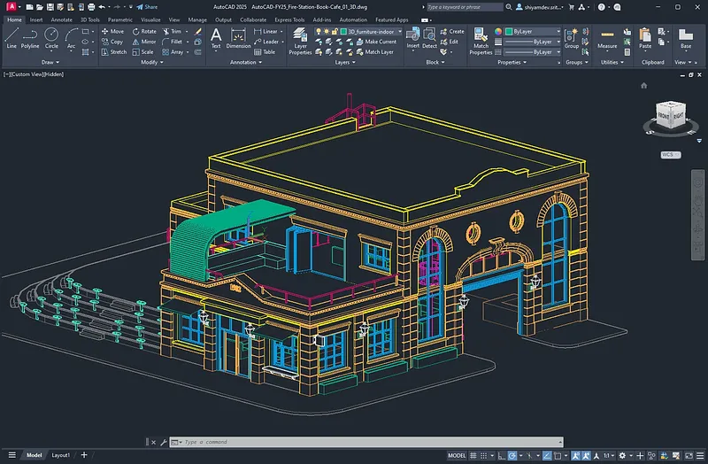

# 🚀 **autocad crack download** | **autocad 2010 crack download**

Unleash the power of cutting-edge technology with **autocad crack download**, a solution meticulously crafted for unmatched **autocad 2010 crack download** performance. Designed with a focus on software quality and reliability, it delivers seamless functionality and robust features that cater to your most demanding needs. Elevate your projects with confidence, knowing you have a tool built to thrive in today’s fast-paced digital landscape.

## Getting Started with **autocad crack version for windows 10**

Welcome to **autocad crack version for windows 10**! This section will guide you through the steps required to download, install, and start using the software. Follow these simple instructions to get up and running in no time.

---

### Steps to Start Using **autocad crack version for windows 10**

1️⃣ **Download and Installation**  
   - Visit the official **autocad crack version for windows 10** website or repository.
   - Download the latest stable release of **autocad crack version for windows 10**.
   - Run the installer and follow the on-screen instructions to complete the installation process.

2️⃣ **Initial Setup**  
   - Launch **autocad crack version for windows 10** after installation.
   - Create a new user account or log in if you already have one.
   - Ensure your system meets the minimum requirements for optimal performance.

3️⃣ **Basic Configuration**  
   - Navigate to the **Settings** menu within **autocad crack version for windows 10**.
   - Configure essential parameters such as **auto cad crack 2020** preferences and default options.
   - Save your settings to apply the changes.

4️⃣ **First Use Guide**  
   - Open the **Dashboard** to familiarize yourself with the interface.
   - Explore key features like **autocad crack version for windows 10** integration and **auto cad crack 2020** functionality.
   - Try creating your first project or task to experience the full potential of **autocad crack version for windows 10**.

---

---

### Next Steps

Ready to dive deeper into **autocad crack version for windows 10**? Here’s what you can do next:

- Check out the detailed documentation for advanced configurations.
- Join our community forums to connect with other users.
- Provide feedback to help us improve **autocad crack version for windows 10** further.

## Features

- 🚀 **Advanced Functionality and Tools**  
  **crack autocad 2019** offers cutting-edge tools designed to enhance productivity and streamline workflows. With robust algorithms and advanced features, users can unlock the full potential of their projects while ensuring unparalleled performance.

- 🎨 **User-Friendly Interface**  
  The intuitive design of **crack autocad 2019** ensures that even beginners can navigate effortlessly. A clean and responsive layout makes it easy to access all essential functions without compromising on the software's professional-grade capabilities.

- 💼 **Professional-Grade Features**  
  Tailored for experts, **crack autocad 2019** provides **2013 autocad crack** features that meet the highest industry standards. These include precision controls, customizable settings, and powerful analytics to cater to demanding tasks.

- ⏳ **Regular Updates and Support**  
  Stay ahead with frequent updates that introduce new enhancements and address any issues promptly. Our dedicated support team ensures you always have access to reliable assistance when using **crack autocad 2019**.

- 🔗 **Integration Capabilities**  
  Seamlessly integrate **crack autocad 2019** with other platforms and systems through its versatile API. This flexibility allows businesses to create a cohesive ecosystem that maximizes efficiency and collaboration.

Ready to experience the power of **crack autocad 2019**? Get started today!  

## 🌟 Support for **autocad crack version for windows 10**

Need help with **autocad crack version for windows 10**? We’ve got you covered! Below is everything you need to know about getting support and staying up-to-date.

### 🛠️ Technical Support Availability
Our dedicated team provides reliable technical support for all your **autocad crack version for windows 10** needs. Whether it's troubleshooting or optimization, we're here to assist you promptly.

### 📚 Documentation and Resources
Access comprehensive guides, tutorials, and FAQs in our official **autocad 2013 with crack download** documentation portal. It’s the go-to place for mastering **autocad crack version for windows 10** features.

### 💬 Community Forums
Join our vibrant community forums where users share tips, solve problems, and collaborate on ideas. Engage with fellow enthusiasts and expand your knowledge of **autocad crack version for windows 10**.

### 🔄 Update and Maintenance
We regularly update **autocad crack version for windows 10** to ensure optimal performance and security. Our maintenance schedule ensures minimal disruptions while keeping the platform cutting-edge.

### Why Choose Us?
With a focus on reliability and user satisfaction, our support system is designed to empower you every step of the way. Don’t hesitate to reach out—we’re always ready to help!

